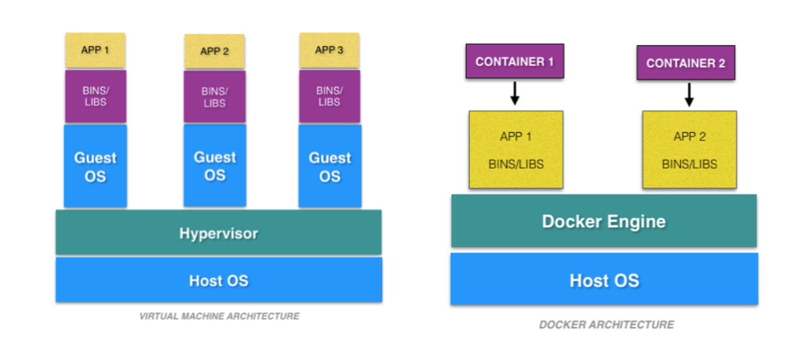
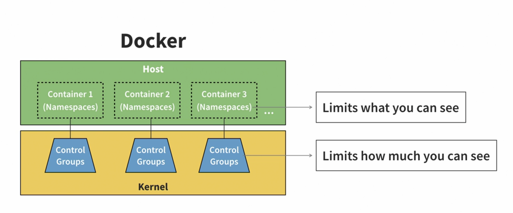
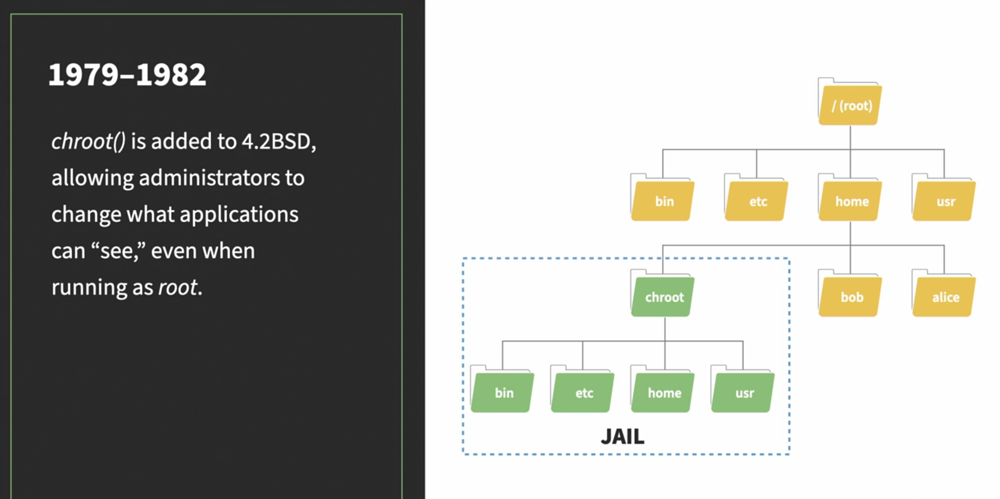
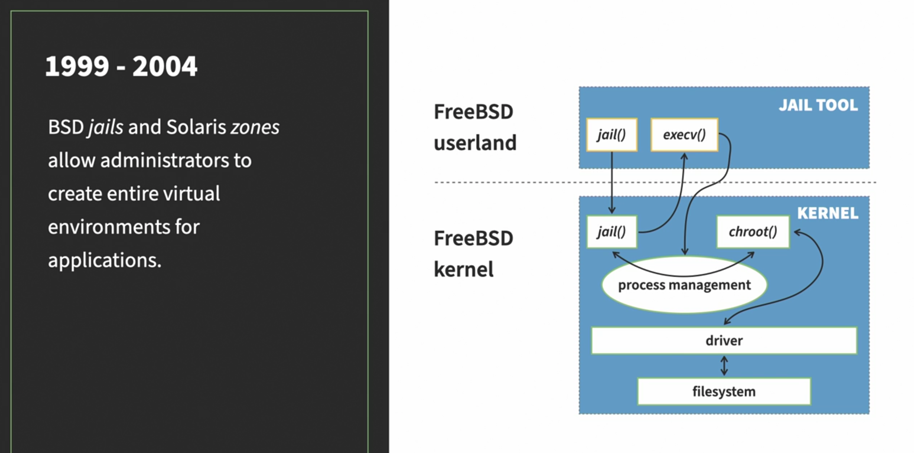
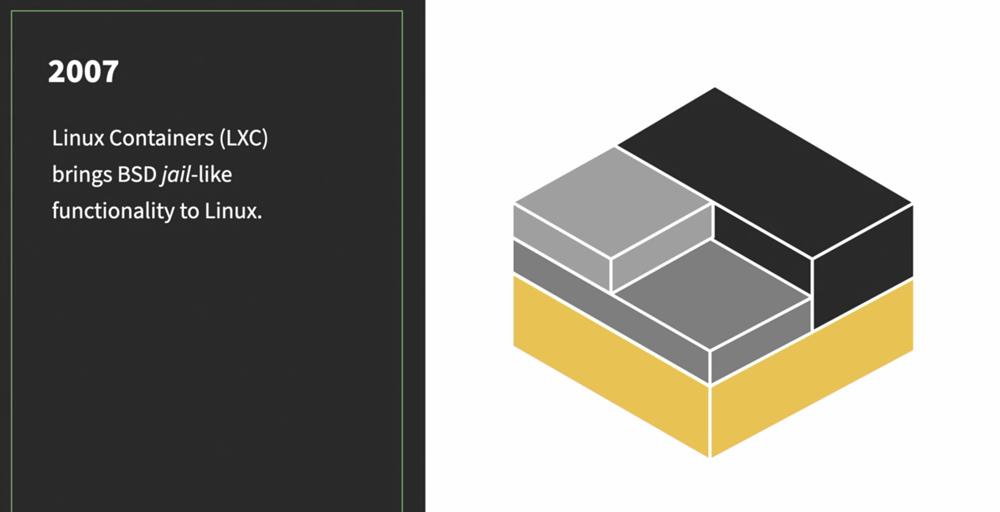

# Docker Tutorial 🚀🐳

This tutorial provides an introduction to Docker and covers the following topics:

- [Introduction to Docker](#introduction-to-docker)
- [Installation](#installation)
- [Docker Basics](#docker-basics)
- [Docker Images](#docker-images)
- [Docker Containers](#docker-containers)
- [Docker Compose](#docker-compose)
- [Docker Networking](#docker-networking)
- [Docker Volumes](#docker-volumes)
- [Dockerfile](#dockerfile)
- [Docker Best Practices](#docker-best-practices)
- [Additional Resources](#additional-resources)

## Introduction to Docker 📦

### What is Docker? 🤔
Docker is a platform that allows you to develop, ship, and run applications in containers. Containers are lightweight, portable, and self-sufficient units that contain everything needed to run an application, including the code, runtime, system tools, libraries, and settings. Docker provides tools and a platform to create, manage, and deploy containers easily and consistently across different environments.

### Containers vs Virtual Machines 🆚
The big difference between containers and virtual machines is that virtual machines virtualize hardware whereas containers virtualize operating system kernels.

### The Virtual Machines 🖥️
- Use the hypervisor to emulate real hardware
- Can take up a lot of space 🗄️
- Require you to install/configure operating system 🛠️
- Can run multiple apps at the same time 🔄
- Cannot interact with their hosts 🚫

### The Containers 🛳️
- Do not emulate any hardware and do not need to **boot up** ⚡
- Do not require operating system installation 🧩
- Take up much less space 🪶
- Can run only one app at a time (by design) 🏃‍♂️
- Can interact with their hosts 🔗

### Summary of Difference 📝
| Containers                       | Virtual Machines          |
| -------------------------------- | ------------------------- |
| Run in container runtimes        | Run on top of hypervisors |
| Work alongside operating systems | Need hardware emulation   |
| Do not require OS configuration  | Require OS configuration  |
| Run one app at a time (usually)  | Can run many apps at once |

### Anatomy of a Container 🔬

### Namespaces 🌐
| Name   | Description                                       |
| ------ | ------------------------------------------------- |
| USERNS | User Lists                                        |
| Mount  | Access to file systems                            |
| NET    | Network communication                             |
| IPC    | Interprocess communication                        |
| Time   | Ability to change time (Not supported by Docker)  |
| PID    | Process ID Management                             |
| CGROUP | Create control groups                             |
| UTC    | Create host/domain names                          |

### Control Group Usage 📊
- Monitor and restrict CPU usage
- Monitor and restrict network and disk bandwidth
- Monitor and restrict memory consumption
- ~~Assign disk quotas~~ (Not supported by Docker)

### Docker Limitations 🚧
- Natively only runs on Linux 🐧
- Container images are bound to their parent operating systems ⚓

### The Docker Difference 🚀

---

Feel free to ask more questions or dive into the specific sections for detailed explanations! 😊
